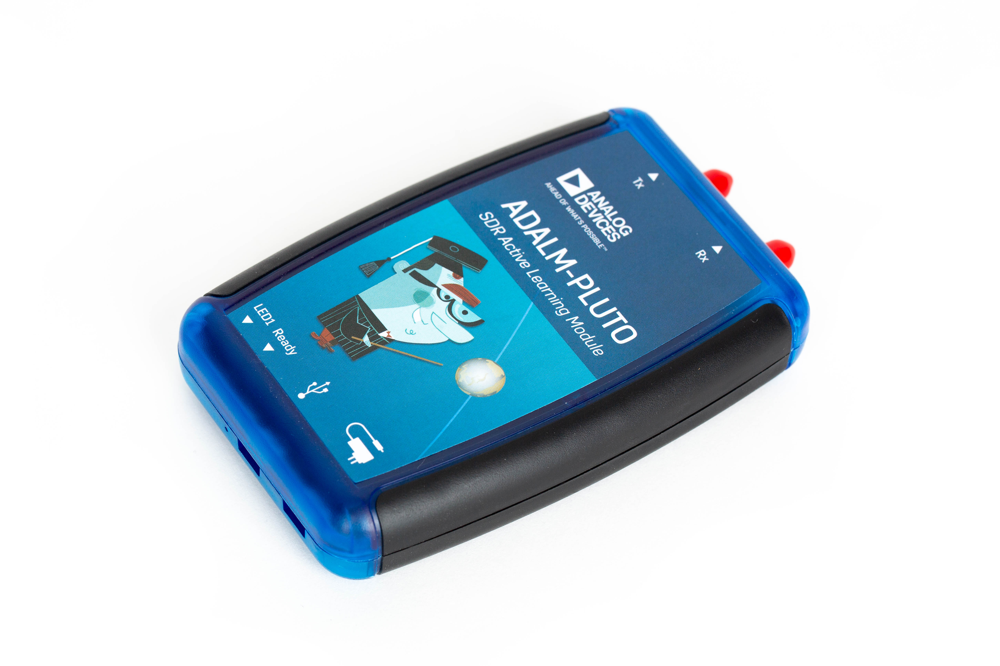
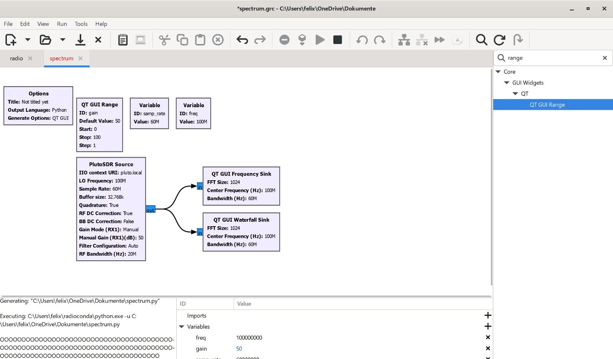
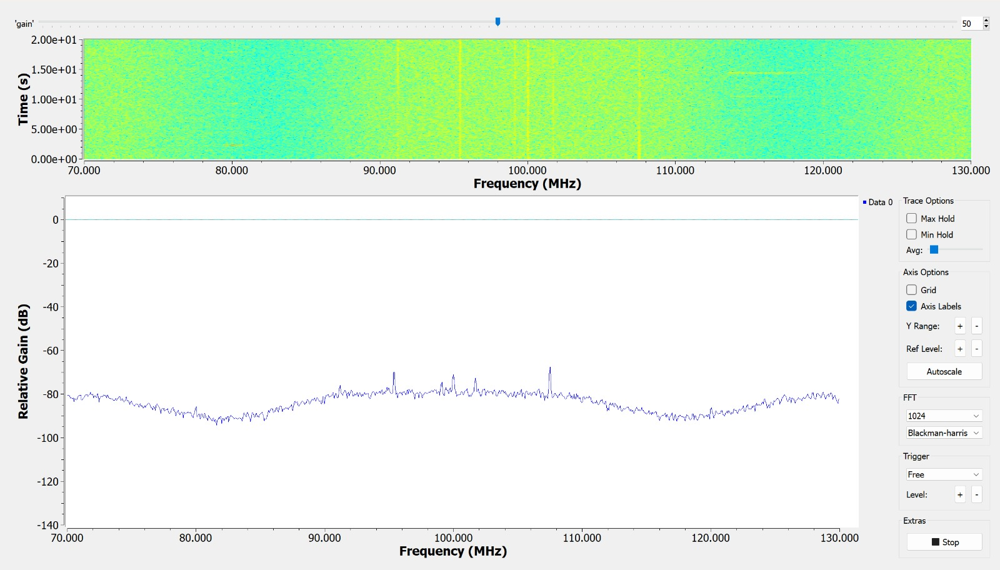
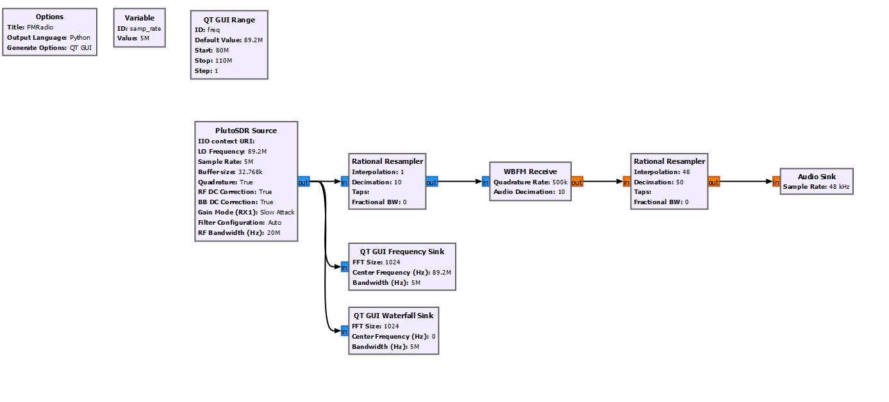
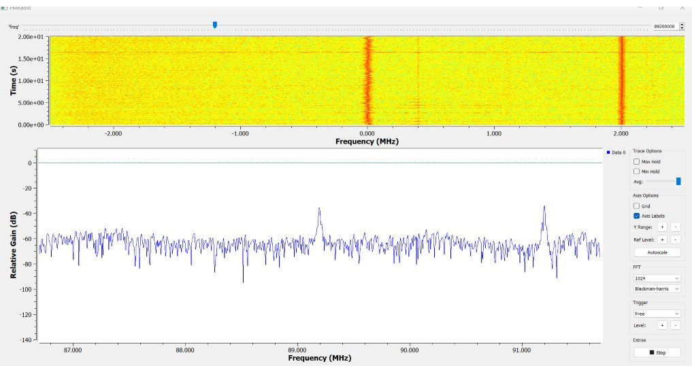

# **&nbsp;&nbsp;&nbsp;&nbsp;&nbsp;&nbsp;&nbsp;&nbsp;&nbsp;&nbsp;&nbsp;&nbsp;&nbsp;&nbsp;&nbsp;&nbsp;&nbsp;&nbsp;&nbsp;&nbsp;PlutoSDR für Frequenzanalyse &nbsp;&nbsp;&nbsp;&nbsp;&nbsp;&nbsp;&nbsp;&nbsp;&nbsp;&nbsp;&nbsp;&nbsp;&nbsp;&nbsp;&nbsp;&nbsp;&nbsp;&nbsp;&nbsp;&nbsp;**

# Inhaltsverzeichnis

1. [Ziel](#ziel)
2. [Hardware](#hardware)
   - [Allgemeine Beschreibung](#allgemeine-beschreibung)
   - [Technische Beschreibung](#technische-beschreibung)
3. [Entwicklungen](#entwicklungen)
   - [Verwendete Programme](#verwendete-programme)
   - [Allgemeine Beschreibung](#allgemeine-beschreibung-1)
   - [Installation des Treibers](#installation-des-treibers)
   - [Installation von GNU-Radio](#installation-von-gnu-radio)
4. [Projekte](#projekte)
   - [GNU Radio Companion Flowgraph für PlutoSDR-Anwendung](#gnu-radio-companion-flowgraph-für-plutosdr-anwendung)
6. [Resümee](#resümee)

---

## Ziel
   Realisierung eines hochmodernen Software Defined Radio (SDR) Systems unter Einsatz der leistungsstarken PlutoSDR-Plattform, das sich auf die akkurate Analyse von Frequenzen sowie die    ansprechende Visualisierung mittels Wasserfall-Darstellungen konzentriert.

## Hardware
   ### Allgemeine Beschreibung
   Das verwendete Hardwaregerät ist das PlutoSDR, eine erschwingliche Lösung für Software-Defined-Radio- 
   Anwendungen. Entwickelt von Analog Devices, bietet das PlutoSDR eine breite Palette von HF-Frequenzen und 
   ermöglicht die bidirektionale Kommunikation über USB. Mit integrierter Antenne und flexibler       
   Signalverarbeitung eignet es sich ideal für verschiedene Funkanwendungen, von der Frequenzanalyse bis hin 
   zur drahtlosen Kommunikationsexperimente. Seine hohe Abtastrate und einfache Bedienung machen es zu einer 
   beliebten Wahl für Bastler und Funkamateure.
   
   ### Technische Beschreibung
   Das PlutoSDR-Gerät ist mit dem leistungsstarken AD9363-Chip von Analog Devices ausgestattet, der eine breite Palette von HF-Frequenzen abdeckt. 
   Diese Frequenzen liegen im Bereich von    70 MHz bis 6 GHz, was eine vielseitige Nutzung des Geräts ermöglicht. Die große Frequenzabdeckung macht 
   das PlutoSDR zu einem idealen Werkzeug für eine Vielzahl von drahtlosen Kommunikationsanwendungen.

   Die Verbindung zwischen dem PlutoSDR und dem Host-Computer erfolgt über eine USB-Schnittstelle, was eine einfache und weit verbreitete Methode der
   Kommunikation ist. Diese       
   bidirektionale Kommunikation ermöglicht es dem Host-Computer, Daten an das PlutoSDR-Gerät zu senden und von ihm zu empfangen, was auch als 
   zwei-Wege-Kommunikation bekannt ist.

   Das PlutoSDR-Gerät verfügt über integrierte Antennen, die die Einrichtung und Verwendung vereinfachen. Diese integrierten Antennen bieten eine gewisse
   Flexibilität und Bequemlichkeit    für den Benutzer und ermöglichen eine einfache Konfiguration des Geräts.

   Eine weitere herausragende Eigenschaft des PlutoSDR ist seine flexible Signalverarbeitung. Mit einer maximalen Abtastrate von bis zu 52 MSPS (Millionen Samples pro Sekunde) bietet       das PlutoSDR eine hohe Bandbreite für die Erfassung und Verarbeitung von Signalen. Diese hohe Abtastrate ermöglicht eine detaillierte Analyse und Verarbeitung von                     
   Hochfrequenzsignalen.

   Darüber hinaus kann das PlutoSDR sowohl als Empfänger als auch als Sender fungieren, was es zu einem äußerst vielseitigen Gerät macht. Diese Funktion ermöglicht es dem Benutzer,         Signale zu empfangen und zu demodulieren oder eigene Signale zu generieren und zu übertragen, je nach den Anforderungen der Anwendung.

   
   
## Entwicklungen
   ### Verwendete Programme
   GNU Radio Companion ist eine einfache Software, mit der dman eigene Software Defined Radio (SDR)-Anwendungen erstellen kann, indem du 
   Flussdiagramme erstellst, um Signalverarbeitungsschritte darzustellen.

   Der Treiber "PlutoSDR-M2k-USB-Drivers.exe" wird benötigt, um das PlutoSDR-Gerät unter Windows zu verwenden. Er ermöglicht die 
   Kommunikation zwischen dem Computer und dem PlutoSDR-Gerät, damit du es für verschiedene Funkanwendungen nutzen kannst.

   ### Allgemeine Beschreibung
   Um loszulegen, ist der erste Schritt die Installation von GNU Radio auf dem Computer. GNU Radio ist eine vielseitige Softwareplattform, die speziell für die Entwicklung von Software    Defined Radio (SDR)-Anwendungen konzipiert wurde.  GNU Radio kann von der offiziellen Website heruntergeladen und auf dem System installieren.

   Nach der Installation von GNU Radio müssen Sie den Treiber für das PlutoSDR-Gerät installieren. Dieser Treiber, bekannt als "PlutoSDR-M2k-USB-Drivers.exe", ermöglicht es Ihrem       
   Betriebssystem, das PlutoSDR-Gerät zu erkennen und eine reibungslose Kommunikation damit sicherzustellen. Die Installation dieses Treibers ist unerlässlich, um sicherzustellen, dass 
   Ihr Computer das PlutoSDR-Gerät korrekt erkennt und Sie es nahtlos mit GNU Radio verwenden können.

   Durch die Installation von GNU Radio und des PlutoSDR-Treibers legen Sie den Grundstein für die Entwicklung und Umsetzung verschiedener Funkanwendungen mit dem PlutoSDR-Gerät. Diese 
   Kombination aus leistungsstarker Software und einem zuverlässigen Treiber ermöglicht es Ihnen, die volle Bandbreite der Funktionen des PlutoSDR-Geräts zu nutzen und Ihre eigenen SDR- 
   Projekte erfolgreich umzusetzen.
   
   ### Installation des Treibers
   Um den Treiber für das PlutoSDR-Gerät zu installieren, muss man die entsprechende [Installationsdatei](https://wiki.gnuradio.org/index.php/InstallingGR) herunterladen. Diese Datei       finden man auf der offiziellen Website von analog Devices oder auf der Supportseite des PlutoSDR-Geräts. Es sollte sichergestellt werden , dass Sie die richtige Version des Treibers    für Ihr Betriebssystem auswählt wird. .
   
   Sobald die Installationsdatei heruntergeladen wurde, führt man sie aus , indem Sie darauf doppelklicken. Dadurch wird der Installationsassistent gestartet, der durch den       
    Installationsprozess führt. Den Anweisungen sollte befolgt den Anweisungen des Assistenten, um den Treiber auf dem System zu installieren. Möglicherweise benötigen man 
    Administratorrechte, um den Treiber erfolgreich zu installieren.
   
   Nach Abschluss der Installation kann überprüfen, ob der Treiber ordnungsgemäß installiert wurde, indem man den Geräte-Manager auf Ihrem Computer öffnen. Es sollte nach gesucht werde 
    Sie nach.

   ### Installation von GNU-Radio
   Um GNU Radio zu installieren, besucht man die  Webseite [offizielle Website](https://wiki.gnuradio.org/index.php/InstallingGR) 
   und laden die passende Installationsdatei für das       
   eigene Betriebssystem herunter. Danach führt man dann das Installationsprogramm aus und folgt den Anweisungen. 
   Dabei sollte  sichergestellt werden , dass alle erforderlichen 
   Abhängigkeiten installiert sind.Nach der Installation des GNU Radio und konfigurieren werden die Einstellungen nach
   den Vorlieben eingebunde. Abschließend sollte berprüft werden, ob 
   die Software ordnungsgemäß funktioniert, indem maneine Beispielanwendung ausführt oder ein neues Projekt erstellen und testen.

  ## Projekte 
   ### GNU Radio Companion Flowgraph für PlutoSDR-Anwendung
   ##### Aufbau 
  
  #### Im Betrieb
   Die erhabenen Gipfel dienen als markante Marker für die Frequenzen der Radiosendeanlagen und fungieren als unverzichtbare Referenzpunkte für Kommunikationstechniker, die sich mit der 
  Feinabstimmung und Optimierung von Übertragungssystemen befassen. Ihre charakteristische Höhe und geografische Platzierung sind entscheidend bei der Ausrichtung von Antennen und der 
 Konfiguration von Sendern, um eine präzise und zuverlässige Tonübertragung zu gewährleisten. Diese Spitzen repräsentieren nicht nur technologische Strukturen, sondern auch das 
 Ergebnis akribischer Frequenzanalyse und Signaloptimierung, die es ermöglichen, eine breite Palette von Tonquellen mit hoher Klarheit und Integrität zu übertragen. Ihre majestätische 
 Präsenz in der Landschaft ist ein Zeichen für die Symbiose zwischen menschlicher Innovation und natürlicher Topographie, wo die Übertragung von Klangwellen nahtlos in die umgebende 
 Umwelt integriert wird.
  
 
### FM Radio
   ##### Aufbau 
   
   ####  Betrieb
    Mit diesem Radio ist Antenne Steiermark gehört worden. Die Tonqualität ist sehr gut 
   gewesen. 
   
  
### Walki Talki 
   ##### Aufbau   
    
   ####  Betrieb
   Der erfolgreiche Aufbau einer Verbindung mittels eines Walkie-Talkies verdeutlicht   
   die effektive Nutzung von drahtloser Kommunikationstechnologie und stellt einen    
   wichtigen Meilenstein in der Arbeit eines Kommunikationstechnikers dar. Durch die 
   Fähigkeit, die Sprache des anderen zu hören und zu verstehen, demonstriert das 
   Walkie-Talkie nicht nur die Zuverlässigkeit seiner Übertragung, sondern auch die 
   Wirksamkeit seiner Empfangs- und Entschlüsselungsfunktionen. Dieser erfolgreiche 
   Kommunikationsprozess ist das Ergebnis einer sorgfältigen Konstruktion und 
   Abstimmung der Geräte, bei der Faktoren wie Frequenzbereiche, Modulationsverfahren 
   und Antennencharakteristiken berücksichtigt werden. 
   Es ist zu sehen, wie in das Walki- Talki gesprochen wird. 
   
    
    
   
  ## Resümee
   Dieses Projekt bietet eine breite Palette an Lernmöglichkeiten. Es können grundlegende Kenntnisse in den Bereichen Software und Hardware erlangt werden.
   Der Schwerpunkt ist dabei auf der Frequenzanalyse und Signalverarbeitung. 
   Zudem können die Fähigkeiten durch Funkanwendungen und Signalverarbeitungsblöcke in GNU Radio erlangt werden. 
    
   Zusammenfassend lässt sich sagen, dass es ein spannendes Projekt ist. Welches durch seine gute Veranschaulichung heraussticht.  
